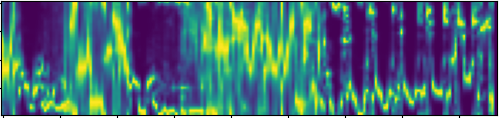

## Deep Learning Classifiers for Urban Sound Data

#### The project

In this project we received a dataset, the urbansound8k dataset, that contains 8732 labeled sound excerpts, each with a duration less than or equal to 4 seconds.  
These sounds excerpts are labeled according to the following classes: air conditioner; car horn; children playing; dog bark; drilling; engine idling; gun shot; jackhammer; siren; street music.  
The aim of this project is to build classifiers that are able to determine to which of the previous 10 classes a given, unseen, sound excerpt belongs to.

#### Notebooks

- Feature_Extraction.ipynb: In this notebook we looked at some features possible to extract from audio files and extracted the ones that will be used later on as inputs for the model (mfccs,chroma_stft);

- CNN.ipynb: A Convolutional Neural Network (CNN or ConvNet) is a type of neural network that has a specific architecture with layers designed to automatically and adaptively learn hierarchical patterns and representations.

- RNN.ipynb: A Recurrent Neural Network (RNN) is a type of artificial neural network designed for sequential data processing. Different from traditional feedforward neural networks, which process input data in a single pass, RNNs have connections that form directed cycles, allowing for them to maintain a hidden state that captures information about previous inputs. The presence of this hidden state allows RNNs to demonstrate temporal dynamics, making them well-suited for tasks that entail sequences, for example time series analysis, natural language processing, and speech recognition.

#### Notes

- All of these notebooks were run using Google Colab

- The following versions were used 
   * python 3.9.6
   * numpy 1.23.0
   * pandas 2.1.1
   * seaborn 0.13.0
   * matplotlib 3.6.0
   * librosa 0.10.1
   * sklearn 0.0.post10
   * tensorflow 2.14.0
   * keras 2.14.0
   * pickle 4.0

- DeepFool: The DeepFool algorithm is an adversarial attack method designed to disturb the  input data in a way that misleads deep neural networks into making incorrect predictions. The goal of this algorithm is to generate small, imperceptible perturbations to input samples that can cause a deep neural network to misclassify them. In our case study we tried the method on both of the network models.

With original inputs, the RNN predicted dog bark

 

With slightly altered inputs, the RNN predicts street music 

 

#### Future Work and Conclusions

- Thanks to DeepFool, we can observe that, for this specific example of learning model and sound sample, the mfccs features barelly change. With this we can assume they have a relatively low relevance to the model and it would probabily be beneficial to use another feature as input. This concludes that a better input could be a good next step in order to inprove performance.
- Another of the experiments we wished to try was transfer learning, but were limited on time and computacional resources.

#### References:

- [https://urbansounddataset.weebly.com/urbansound8k.html](https://urbansounddataset.weebly.com/urbansound8k.html)

- [https://www.kaggle.com/code/badl071/urban-sounds-classification-using-cnns](https://www.kaggle.com/code/badl071/urban-sounds-classification-using-cnns)

- [https://github.com/AmritK10/Urban-Sound-Classification](https://github.com/AmritK10/Urban-Sound-Classification)

- [https://github.com/aminul-huq/DeepFool/blob/master/DeepFool.ipynb](https://github.com/aminul-huq/DeepFool/blob/master/DeepFool.ipynb)

- [https://openaccess.thecvf.com/content_cvpr_2016/papers/Moosavi-Dezfooli_DeepFool_A_Simple_CVPR_2016_paper.pdf](https://openaccess.thecvf.com/content_cvpr_2016/papers/Moosavi-Dezfooli_DeepFool_A_Simple_CVPR_2016_paper.pdf)
